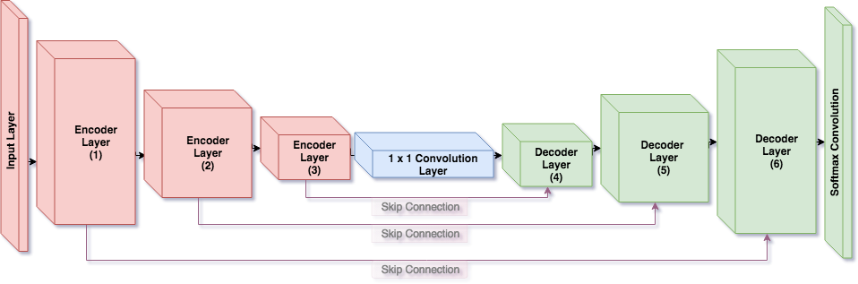
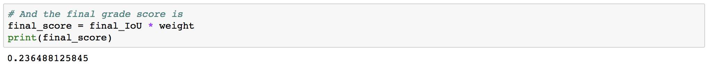
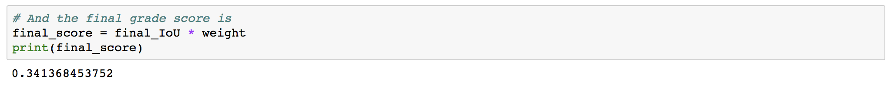
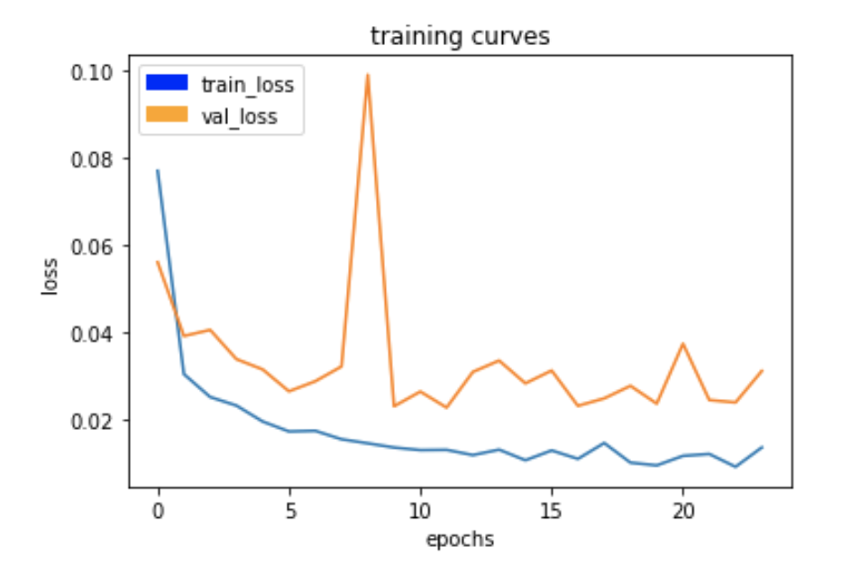
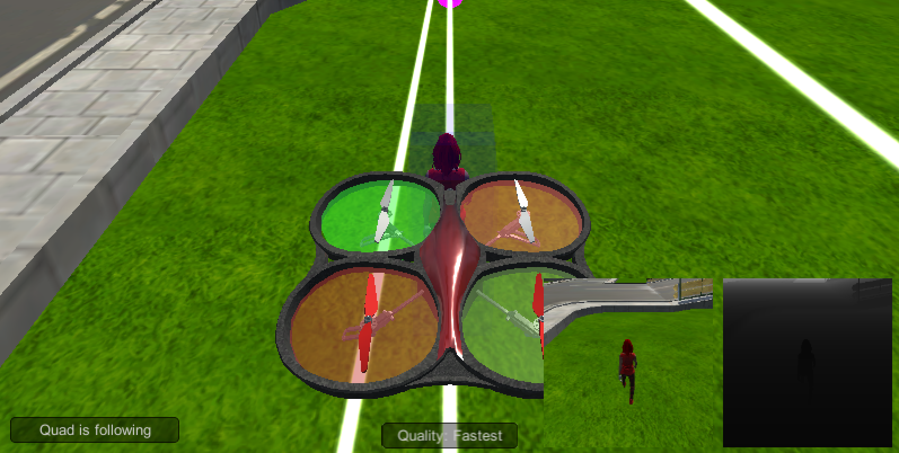

[](https://www.udacity.com/robotics)

## Deep Learning Project
### Writeup by Ayo Adedeji
---
#### Instructions on how to implement segmentation network, collection training data, train model, and test in simulation are found here [here](./project_setup.md).

## [Rubric](https://review.udacity.com/#!/rubrics/1155/view) Points
---
### Achieving Semantic Segmentation using a Fully Convolutional Neural Network 
In a Fully Convolutional Neural Network (FCN), each layer is a convolutional layer. This differs from approaches to classification in typical convolutional network schemes where a fully connected layer (each neuron is connected to each neuron in an antecedent layer allowing for spatial and global integration of multiple features) or a multilayered perceptron is applied at end of a convolutional neural network. A convolutional layer is applied at the end of FCNs to classify (i.e label with a color) pixel state of an input image. Semantic segmentation is achieved by producing an output layer with spatially matched dimensionality in which each pixel from the input image is classified and spatial information from input layer ultimately retained — this faciliates identification of objects through encoded location in local space and is the basis of training an FCN to get a simulated quadcopter to follow a target in space. FCN architecture for semantic segmentation consists of an encoder network (a series of convolutional layers that extract and integrate features on input layer and reduce to a 1x1 convolution layer) followed by a decoder network (a series of convolutional layers that projects the finer, higher resolution features of the encoder network into the features of the output layer with spatially matched dimensionality).  

#### Encoder Network
Each layer of the encoder network is a separable convolution layer that reduces the number of parameters as would be required by a regular convolution layer. This reduction of needed parameters ultimately functions to improve runtime efficiency and also reduce overfitting by providing less parameters to which to fit to (obliges network to focus more on generalized patterns)
* Separable convolution layers for each encoder block in the FCN was generated through the following helper function
* A ReLU activation function, *same* padding parameter, and kernel_size = 3 are applied by default.
```python
def encoder_block(input_layer, filters, strides):
    # Create a separable convolution layer using the separable_conv2d_batchnorm() function.
    output_layer = separable_conv2d_batchnorm(input_layer, filters, strides)
    return output_layer
    
 def separable_conv2d_batchnorm(input_layer, filters, strides=1):
  output_layer = SeparableConv2DKeras(filters=filters,kernel_size=3, strides=strides,
                           padding='same', activation='relu')(input_layer)

  output_layer = layers.BatchNormalization()(output_layer) 
  return output_layer
```
#### Decoder Network
To project the lower resolution features of the encoder layers into the higher resolution features of each output layer (in other words, to achieve upsampling), I used the bilinearly upsampling approach of averaging the four nearest pixels located diagonally to each pixel to arrive at a new pixel value for new pixel values.
* Upsampling by a factor of 2 was implemented through the following helper function (with a keras backend)
```python
def bilinear_upsample(input_layer):
    output_layer = BilinearUpSampling2D((2,2))(input_layer)
    return output_layer
   
def decoder_block(small_ip_layer, large_ip_layer, filters):
    # Upsample the small input layer using the bilinear_upsample() function.
    upsampled_input_layer = bilinear_upsample(input_layer=small_ip_layer)
    # Concatenate the upsampled and large input layers using layers.concatenate
    concatenated_upsampled_and_large_input_layer = layers.concatenate([upsampled_input_layer, large_ip_layer])
    # Add some number of separable convolution layers
    separable_convolution_layer_1 = separable_conv2d_batchnorm(input_layer=concatenated_upsampled_and_large_input_layer, filters=filters)
    separable_convolution_layer_2 = separable_conv2d_batchnorm(input_layer=separable_convolution_layer_1, filters=filters)
    output_layer = separable_conv2d_batchnorm(input_layer=separable_convolution_layer_2, filters=filters)
    return output_layer
```
Layer concatenation and three following separable convolution layers are implemented after upsampling small input layer to In to optimize the preservation of fine, higher resolution details from preceding layers as the decoder network decodes and upsamples to a size that has equivalent dimensionality with initial input layer. Concatenating layers is equivalent to element-wise addition of layers but does not require all layers to have same to execute operation.

##### Batch Normalization
Each layer within the encoder and decoder blocks is normalized. Normalizing inputs to a layer enhances performance because input data with more variance around mean will result in opinionated weighting that harshly penalizes increasing distance from central mean peak; input data with less variance around mean results in less opinionated weighting at start that only becomes more opinionated with training / learning of patterns within data. Batch normalization encompasses treating each layer as input layer to a smaller network and requires normalization of each layer's inputs.
```python
output_layer = layers.BatchNormalization()(output_layer) 
```
### FCN Model

<p align="center"></p>

```python
def fcn_model(inputs, num_classes):
    # Add Encoder Blocks. 
    # Remember that with each encoder layer, the depth of your model (the number of filters) increases.
    encoder_block_layer_1 = encoder_block(input_layer=inputs, filters=32, strides=2)
    encoder_block_layer_2 = encoder_block(input_layer=encoder_block_layer_1, filters=64, strides=2)
    encoder_block_layer_3 = encoder_block(input_layer=encoder_block_layer_2, filters=128, strides=2)
    # Add 1x1 Convolution layer using conv2d_batchnorm().
    one_to_one_convolution_layer = conv2d_batchnorm(input_layer=encoder_block_layer_3, filters=256, kernel_size=1, strides=1)
    # Add the same number of Decoder Blocks as the number of Encoder Blocks
    decoder_block_layer_4 = decoder_block(small_ip_layer=one_to_one_convolution_layer, large_ip_layer=encoder_block_layer_2, filters=128)
    decoder_block_layer_5 = decoder_block(small_ip_layer=decoder_block_layer_4, large_ip_layer=encoder_block_layer_1, filters=64)
    x = decoder_block(small_ip_layer=decoder_block_layer_5, large_ip_layer=inputs, filters=32)
    # The function returns the output layer of your model. "x" is the final layer obtained from the last decoder_block()
    return layers.Conv2D(num_classes, 1, activation='softmax', padding='same')(x)
```
The architecture of the FCN model of my project consists of three encoder layers and three decoder block layers. After each encoder layer, the depth of the model doubles. I choose to have the depth double after each layer in relation to value of the stride parameter choosen for each encoder layer of 2. Moreover, given that the width-height dimensionality of each encoder layer reduces by a factor of ~2 after each convolution given stride of 2, to prevent loss of finer details and to optimize preservation of spatial information, I translated reduction in width-height dimensionality after each convolution to increased depth / more filters are present after each convolution.
* I first tried an FCN model of two encoder layers followed by two decoder layers but performance was suboptimal (final score of ~.23). I added additional encoder and decoder layers and was able to bump up performance up to ~.34 mark (after tinkering around with hyperparameters from here I was able to get over pass mark of .40). 
    <p align="center"></p>
    <p align="center"></p>
    * I discuss hyperparameter tuning in next section.
* Regarding the 1 x 1 convolution layer, in general, a 1 x 1 convolution is a feature pooling technique that is implemented to reduce filter depth dimensionality. A 1 x 1 convolution may also be used to introduce added nonlinearity to a model. I found that when I reduced the filter depth of the 1 x 1 convolution layer performance of the FNC model suffered. I suppose this reduction in performance stems from a loss of higher detail resolution due to reductive feature pooling. I found that keeping filter depth at 128 or further doubling it to 256 optimized for FCN model performance. As a side note, I tested out a filter depth of 256 to see how that would affect performance and it seemed to give a slight boost in performance to the FCN model — I suppose this is due to a degree of enhanced fitting from expanded features.

* _limitations to the neural network with the given data chosen for various follow-me scenarios of dog, cat, and car as opposed to human_: This FCN model would not work with the given data for the follow-me scenarios of dog, cat, and car. As mentioned above in the intro, semantic segmentation is achieved by producing an output layer with spatially matched dimensionality in which each pixel from the input image is classified and spatial information from input layer ultimately retained. Classification of pixel space requires feature weighing (through ReLu activation or other function) that gives way to more complex, integrated featured at deeper layers of the encoder network. To prevent overfitting, there are various techniques to force the network to learn generalized patterns, but even then it must be recognized that the general patterns the network learns are patterns specific to the follow-me object (which in this case is a human form). The FCN model likewise would not perform well for a dog or cat and especially not too well for a car __with given data__. Conversely, if the FCN model was trained with a dataset specific to a dog, we might expect an appreciable degree of performance for local classfication of a cat due to overlapping similarity of dog and cat features.

### Training (Hyperparameter Tuning + AWS)
To establish a viable set of hyperparameters, specifically, values for learning rate, batch size, number of epochs, and steps per epoch I used the segmentation lab notebook from the [RoboND Segmentation Lab](https://github.com/udacity/RoboND-Segmentation-Lab) and performed brute force hyperparameter tuning (supplemented by intuition received from general tips on the [slack channel](https://udacity-robotics.slack.com/messages/C4FJQBWFR) for this project). Due to slow CPU computational speed on my laptop, I initially fixed num_epochs at 2, while optimizing other hyperparameters in the segmentation lab notebook. It took approximately 1 hour for each epoch on my laptop before I made the transition to a p2.xlarge instance hosted by AWS when I was validating functional sets of hyperparameters. On the p2.xlarge instance, it took about 2 - 5 minutes per epoch, depending on the hyperparameter set, which was a big improvement in speed.
* Regarding data collection, I used preexisting data set and did not collect my own data. Ideally, I am aware more collected data would translate to better performance (assuming data consists of photos with right degree of variance pertaining to the follow-me target and surroundings) but I was short on time. Through the slack channel mentioned above, I discovered preexisting data was robust enough to reach a final score > .40, so I focused on optimizing hyperparameters for preexisting train and validation data.

#### Final choice for hyperparameter values
```python
learning_rate = .008
batch_size = 32
num_epochs = 24
steps_per_epoch = 480
validation_steps = 50 # default
workers = 2  # default
```
* __learning_rate__: Holding num_epochs, batch_size, and steps_per_epoch constant at 2, 16, and 500 respectively, I started with a learning rate of .03 and tuned the learning rate after each run to optimize for convergence and loss minimization. I immediately recognized that any learning_rate greater than about .015 was too large to allow proper convergence (additionally, adding more epochs did not help the issue when learning_rate was set too high). I then settled on a learning rate of .01 and tried to then optimize it for performance. I noticed decreasing the learning rate below **.008** impacted the performance of the network (resulted in a decrease in final score), so I left the learning rate at .008.
* __batch_size__: Holding learning_rate, num_epochs, and steps_per_epoch constant at .01, 2, and 500 respectively,  I started with a batch size of 4 and doubled the batch size after each run. Up to a batch size of **32**, the time per epoch decreased while performance of the network steadily increased. Higher than a batch size of 32, the time per epoch seemed to decrease while the performance of the network degraded.
* __num_epochs__: After switching to p2.xlarge on AWS, I was able to start tuning this hyperparameter. At first I set this value to 40 with learning_rate, batch_size, and steps_per_epoch at .008, 32, and 500. I noticed that after about 25 epochs additional epochs did not really help performance of the network (most likely due to overfitting). I set the value for this hyperparameter at **24** which is right below the point at which I noticed decreasing returns for additional epochs.
    * Example: divergence (due to overfitting) starts to occur after 25 epochs
    <p align="center"></p>
* __steps_per_epoch__: The first value I tried for this hyperparameter was 500. I optimized for all other hyperparameters (while using the default given value for the _validation_steps_ and _workers_ hyperparameters) before I tuned this hyperparameter. Once I had settled on working hyperparameters for other hyperparameters, tuning this hyperparameter did not seem to affect much with regards to overall performance other than computatation time (which is a ultimately still an important consideration). I settled on a value of **480** because I did not want to veer away too much from the initial value of 500 which was functional but I also wanted to slightly decrease computational time.

### Prediction / Evaluation Results

My final trained model (and its config file) can be found [here](./data/weights)
* With this model I was able to achieve a final score of .413
#### Scores for while the quad is following behind the target.
number of validation samples intersection over the union evaulated on 542 \
average intersection over union for background is 0.996086873701149 \
average intersection over union for other people is 0.37960521360255967 \
average intersection over union for the hero is 0.8859202840784893 \
number true positives: 537, number false positives: 0, number false negatives: 2

#### Scores for images while the quad is on patrol and the target is not visable
number of validation samples intersection over the union evaulated on 270 \
average intersection over union for background is 0.986605416320466 \
average intersection over union for other people is 0.7317068795062905 \
average intersection over union for the hero is 0.0 \
\number true positives: 0, number false positives: 13, number false negatives: 0 

#### This score measures how well the neural network can detect the target from far away
number of validation samples intersection over the union evaulated on 322 \
average intersection over union for background is 0.9969784507861674 \
average intersection over union for other people is 0.47084940035162237 \
average intersection over union for the hero is 0.19596187533328782 \
\number true positives: 114, number false positives: 0, number false negatives: 187

#### Sum all the true positives, etc from the three datasets to get a weight for the score
```python
true_pos = true_pos1 + true_pos2 + true_pos3
false_pos = false_pos1 + false_pos2 + false_pos3
false_neg = false_neg1 + false_neg2 + false_neg3

weight = true_pos/(true_pos+false_neg+false_pos)
print(weight)
```
0.7631887456037515

#### The IoU for the dataset that never includes the hero is excluded from grading
```python
final_IoU = (iou1 + iou3)/2
print(final_IoU)
```
0.540941079706

#### And the final grade score is 
```python
final_score = final_IoU * weight
print(final_score)
```
0.412840144066

#### "Follow me" in action
<p align="center"></p>

### Future Enhancements
* __Intelligent / Automated Hyperparameter Tuning__
Hyperparameter tuning in this project was a long and tedious process. Through brute force, I was able to settle on a set of hyperparameters that was ultimately functional but not optimal (i.e the computational time required coupled with the relatively low performance score indicates much optimization still needs to be done). Using the [Hyperopt library](https://hyperopt.github.io/hyperopt/) to achieve distributed, asynchronous optimization or implementing Bayesian optimization methods such as random forest regression or gaussian process surrogate models could serve to facilitate efficient, optimized hypertuning.
* __Detail Optimized Pooling__: There are various pooling techniques and methods that serve to optimize preservation of feature details. With more time, I would try out different combinations of max and average pooling techniques (which increase the receptive field relative to a feature or give added weight to increased frequency of a feature in pixel space respectively) and assess how different combinations of these techniques affect classification as measured by IoU.
* __Compare and Contrasting Weight Decay Regularization Techniques__: I would like to see how different weight decay regularization techniques affect runtime efficiency and potentially improve or degrade local classification 
in the output layer of the FCN model. 
